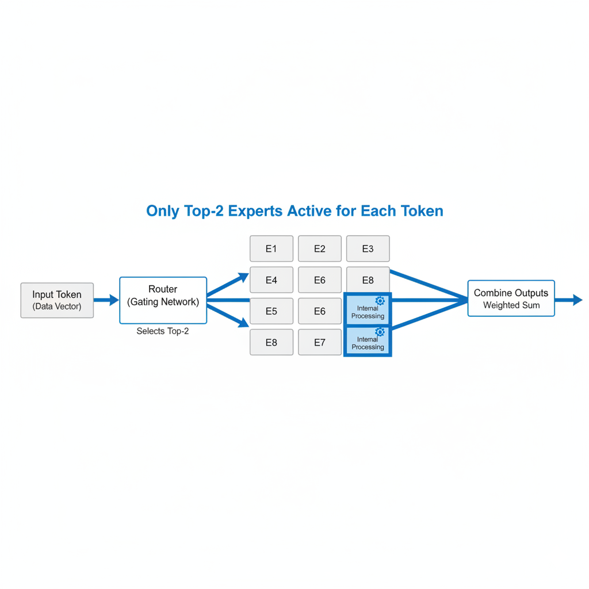

# Understanding Our Large Language Model: A Complete Breakdown

At Open Superintelligence Lab, we are committed to fully open research. Our research goal is to train GPT-4 level LLM from the ground up for under $100 of compute, making advanced AI accessible to everyone. This article encapsulates our comprehensive understanding of our Large Language Model (LLM), breaking down each component to elucidate its architecture and underlying mathematics. This represents all our learnings about this LLM, providing a complete understanding of how it works.

## Overview

- **Multi-Head Latent Attention (MHLA)**: Efficient key-value compression with LoRA integration
- **Mixture of Experts (MoE)**: Dynamic expert routing with load balancing
- **Transformer Blocks**: RMSNorm and residual connections
- **Hybrid Optimization**: Muon optimizer with Newton-Schulz orthogonalization + AdamW
- **Sparse (Linear) Attention**: Dynamic token selection mechanisms

Let's break down each component in detail:

## 1. Multi-Head Latent Attention (MHLA)

MHLA is our advanced attention mechanism (by DeepSeek) that dramatically reduces computational complexity while maintaining performance. It's the core innovation that makes our model efficient.

### How MHLA Works

Traditional attention has quadratic complexity O(n²) with respect to sequence length. MHLA reduces this by compressing the key-value representations and using Low-Rank Adaptation (LoRA).

### Key-Value Compression

Instead of using full-dimensional key and value matrices, MHLA compresses them:


```
K_compressed = K × W_k  (where W_k projects from 384 → 64 dimensions)
V_compressed = V × W_v  (where W_v projects from 384 → 64 dimensions)
```

This reduces the attention computation from O(n² × 384) to O(n² × 64), a 6x reduction in the quadratic term.

### LoRA Integration

LoRA (Low-Rank Adaptation) allows efficient fine-tuning by decomposing weight updates:


```
ΔW = A × B
```

Where:
- A ∈ ℝ^(384×64): Low-rank matrix A
- B ∈ ℝ^(64×384): Low-rank matrix B  
- Rank = 64, which is much smaller than the original dimension (384)

This means instead of updating 384×384 = 147,456 parameters, we only update 2×384×64 = 49,152 parameters.

### Query Processing

Our model uses two approaches for query processing:

**Standard Approach:**
```
Q = X × W_Q
```

**LoRA Approach:**
```
Q = LayerNorm(X × W_Qa) × W_Qb
```

Where W_Qa and W_Qb are the LoRA matrices.

### Attention Computation

The final attention computation:

```
Attention(Q, K_compressed, V_compressed) = softmax(Q × K_compressed^T / √d_k) × V_compressed
```

**Research:**
1. Understand MLA, draw graphs.
2. Understand indexing, sparse attention, draw graphs.

## 2. Mixture of Experts (MoE)

MoE improves inference. Instead of using all feedfoward parameters, MoE will select an "expert", a small feedfoward network. Our model has 8 experts, but only activates the top-2 for each token. This means we get the capacity of 8 experts but only pay the computational cost of 2.


```
Expert_i(x) = W_i2 × SiLU(W_i1 × x + b_i1) + b_i2
```



**What each weight matrix does:**
- **W_i1 ∈ ℝ^(384×1536)**: First layer weights - expands from 384 hidden dimensions to 1536 intermediate dimensions
- **W_i2 ∈ ℝ^(1536×384)**: Second layer weights - compresses back from 1536 intermediate dimensions to 384 hidden dimensions
- **b_i1**: Bias for first layer (1536 dimensions)
- **b_i2**: Bias for second layer (384 dimensions)
- **SiLU**: Swish activation function (x × sigmoid(x))

The router decides which experts to use for each token:

```
G(x) = sigmoid(x × W_gate)  # Gate scores for all 8 experts
```

Where W_gate ∈ ℝ^(384×8) produces scores for each expert.

For each token, we select the top-2 experts:

```
top_k_indices = argmax_k(G(x))  # Get indices of top-2 experts
top_k_weights = softmax(G(x)[top_k_indices])  # Normalize weights
```

The final output combines the selected experts:

```
y = Σ(i∈selected_experts) w_i × Expert_i(x)
```

### Load Balancing Loss

To prevent some experts from being overused, we add a load balancing loss:

```
L_aux = λ × N_experts × Σ(i=1 to N_experts) f_i × p_i
```

Where:
- f_i: Fraction of tokens routed to expert i
- p_i: Average routing probability for expert i  
- λ = 0.01: Load balancing weight
- N_experts = 8

**Benefits:**
- Specialization: Each expert can learn different patterns
- Scalability: Easy to add more experts
- Load balancing: Prevents expert collapse

**Research:**
1. Understand how it works, draw graphs.
2. Try DeepSeek's auxiliary loss free load balancing.

## 3. Transformer Blocks

Transformer blocks are the building units of our model. Each block contains MHLA attention and MoE feed-forward layers with normalization and residual connections.

### Block Architecture

Each transformer block follows this structure:


```
h' = h + MHLA(RMSNorm(h))      # Self-attention with residual
h'' = h' + MoE(RMSNorm(h'))    # MoE feed-forward with residual
```

### RMSNorm

We use RMSNorm instead of LayerNorm for better stability:


```
RMSNorm(x) = x / √(1/d × Σ(x_i²) + ε) ⊙ w
```

Where:
- d = 384: Hidden dimension
- ε = 1e-6: Small constant for numerical stability
- w: Learnable scaling parameter

**Why RMSNorm?**
- More stable than LayerNorm
- Slightly faster computation
- Better gradient flow

### Residual Connections

Residual connections help with gradient flow in deep networks:


```
output = input + sublayer(input)
```

This ensures that gradients can flow directly through the network.

**Benefits:**
- Prevents vanishing gradients
- Enables deeper networks
- Improves training stability

## 4. Muon Optimizer: Matrix-Aware Learning

The Muon optimizer is a revolutionary approach to neural network optimization that enforces spectral norm constraints on weight matrices. It's particularly effective for optimizing weight matrices in neural networks.

Muon stands for "MomentUm Orthogonalized by Newton-schulz". It combines momentum with orthogonalization to create updates that respect the geometry of the parameter space.

#### Step 1: Momentum Update
```
m_t = β × m_{t-1} + (1-β) × g_t
```

Where:
- β = 0.95: Momentum coefficient
- g_t: Current gradient
- m_t: Momentum buffer

#### Step 2: Newton-Schulz Orthogonalization

This is the key innovation. We orthogonalize the gradient using Newton-Schulz iteration:

**Initialization:**
```
G_0 = m_t / (||m_t||_F + ε)
```

**Iteration (5 steps):**
```
A_k = G_{k-1} × G_{k-1}^T
B_k = b × A_k + c × A_k²  
G_k = a × G_{k-1} + B_k × G_{k-1}
```

Where the coefficients are:
- a = 3.4445
- b = -4.7750  
- c = 2.0315

#### Step 3: Parameter Update
```
θ_{t+1} = θ_t - α × max(1, √(m/n)) × G_5
```

Where:
- α: Learning rate
- m, n: Matrix dimensions
- G_5: Final orthogonalized gradient

### Why Newton-Schulz?

Newton-Schulz iteration approximates the inverse square root of a matrix without computing eigenvalues. This is crucial because it is fast, stable, orthogonalizes updates, and keeps the spectral norm of weight matrices under control.

We use a hybrid approach in our model:

**Muon Optimizer** for:
- Attention weight matrices (W_Q, W_K, W_V, W_O)
- Feed-forward weight matrices (W_1, W_2)
- Expert weight matrices
- Any 2D weight matrices

**AdamW Optimizer** for:
- Embedding layers
- Normalization layers (RMSNorm)
- Bias terms
- 1D parameters

### Learning Rate Schedule

We use a cosine schedule with warmup:

```
lr(t) = {
  (t/T_warmup) × lr_max                    if t < T_warmup
  lr_min + 0.5×(lr_max-lr_min)×(1+cos(π×(t-T_warmup)/(T_total-T_warmup)))  otherwise
}
```

**Benefits:**
- Smooth learning rate decay
- Better convergence
- Reduced oscillation
- Improved final performance

## 5. Training Framework

Our training framework combines several advanced techniques to achieve efficient and stable training.

### Loss Function

The total loss combines the main language modeling loss with auxiliary losses:

```
L_total = L_CE + L_aux
```

Where:
- L_CE: Cross-entropy loss for language modeling
- L_aux: MoE load balancing loss

### Cross-Entropy Loss

```
L_CE = -Σ(i=1 to |V|) y_i × log(p_i)
```

Where:
- |V|: Vocabulary size
- y_i: True token probability
- p_i: Predicted token probability

### Gradient Accumulation

We accumulate gradients over multiple micro-batches:

```
g_accumulated = (1/G) × Σ(i=1 to G) g_i
```

Where G is the gradient accumulation steps (default: 4).

### Mixed Precision Training

We use Automatic Mixed Precision (AMP) to reduce memory usage:

- **Forward pass**: Float16 for speed
- **Gradient computation**: Float32 for stability
- **Parameter updates**: Float32 for precision

### Gradient Clipping

We clip gradients to prevent exploding gradients:

```
g_clipped = min(1.0, threshold/||g||) × g
```

Where threshold = 1.0.

### Training Configuration

**Key Parameters:**
- Batch size: 24
- Gradient accumulation: 4 steps
- Maximum steps: 20
- Learning rate: 0.01 (Muon), 0.001 (AdamW)
- Weight decay: 0.1
- Dropout: 0.1

**Benefits:**
- Memory efficient training
- Stable convergence
- Better generalization
- Faster training
